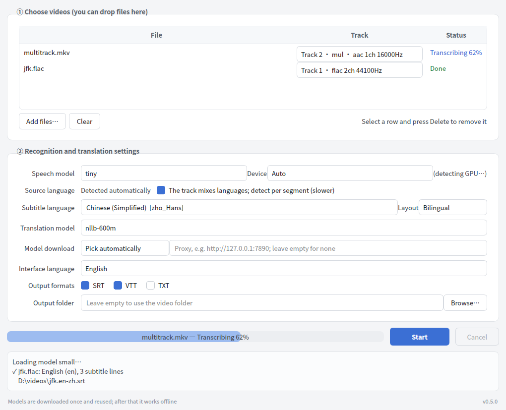

# Subtitle Tool

[中文](README.md) | **English**

Generate subtitles from the soundtrack of any video: the spoken language is detected
automatically, multi-track sources are supported, and the result can be translated into
the language you want. Everything runs locally — nothing is uploaded.

- 🎬 **Any video** — MP4 / MKV / MOV / AVI / TS / WebM…, and plain audio files too
- 🔊 **Multi-track** — lists every audio track in the source (with its language tag) so you can pick
- 🌍 **99 languages** — detected automatically; a track that mixes languages is labelled segment by segment
- 🈯 **Any target language** — 99 of them, written out as translation / source / both
- 📄 **SRT / VTT / TXT**, batch processing, cancel at any time
- 🌐 **Chinese and English interface** — follows your system language, switchable at any time
- 🧳 **Truly portable** — settings and logs live next to the executable; copy the folder, keep everything
- 🔌 **Works offline** — after the first download the models are reused from the local cache

## Quick start

1. Download `subtitle-tool-windows-x64.zip` from
   [Releases](https://github.com/liny90626/subtitle_tool/releases)
2. Unpack it anywhere and double-click `SubtitleTool.exe` — no installation needed
3. Drop your videos into the window → pick the track and target language → click Start

The first run downloads the models (75MB–1.6GB for the speech model depending on the size
you pick, 620MB for the translation model) and reuses them from then on; by default they
live in `%USERPROFILE%\.cache\huggingface`. The models are hosted on huggingface.co, which
is unreachable from some networks — the program then switches to the `hf-mirror.com` mirror
on its own, and you can also pick a source or set a proxy under "Model download". See
[Models will not download](#models-will-not-download).

The interface follows your system language and can be switched to 中文 or English under
"Interface language"; the change takes effect immediately, no restart needed.

**Upgrading**: just unpack the new version over the old directory. On startup the program
removes whatever the previous version left behind, using the file list shipped with the
build. The model cache lives in your user folder, outside the program directory, so nothing
has to be downloaded again, and `settings.json` is kept.

Only one copy runs at a time; opening it again tells you it is already running.



## Which speech model

Measured on an 8-core CPU with int8 quantisation and no GPU:

| Model | Download | CPU speed | 1 hour of video | Notes |
| --- | --- | --- | --- | --- |
| `tiny` | 78 MB | — | — | Only good for a quick try |
| `base` | 148 MB | 9.3× realtime | ~6 min | Fast, so-so accuracy |
| `small` | 486 MB | 2.7× realtime | ~22 min | **Default without a GPU**, fine for daily use |
| `medium` | 1.5 GB | — | — | Middle ground |
| `distil-large-v3` | 1.5 GB | — | — | Distilled, clearly faster than large-v3 |
| `large-v3-turbo` | 1.6 GB | 0.72× realtime | ~83 min | **Default with a GPU**, best accuracy |
| `large-v3` | 3.1 GB | — | — | Most accurate and slowest |

> ⚠️ On a CPU, `large-v3-turbo` is **slower than the video itself** — an hour of footage
> takes more than 80 minutes. The program therefore probes for a GPU at startup and
> defaults to `small` when it does not find one. Actual timings vary with the number of
> CPU cores and the audio itself.

## Using a GPU

The portable build ships CPU inference only; bundling the CUDA runtime would grow it from
280MB to 3GB unpacked. With an NVIDIA card, install the CUDA 12 runtime and the program picks it up:

```powershell
pip install nvidia-cublas-cu12 nvidia-cudnn-cu12
```

Copy the DLLs from those two packages next to the executable, or run from source as shown
below. Leave "Device" on "Auto" — it falls back to the CPU when no GPU is found.

## Models will not download

`ConnectTimeout: [WinError 10060]`, or "cannot find the appropriate snapshot folder", both
mean the download source cannot be reached. It has nothing to do with your video. Try, in
order:

1. Leave "Model download" on "Pick automatically" — when the official host is unreachable
   the program switches to the `hf-mirror.com` mirror, which fixes most cases;
2. If you have a proxy or VPN, put its address in the box next to it, e.g.
   `http://127.0.0.1:7890`;
3. If neither works (corporate network, offline machine), download the models on a machine
   that has access and copy the whole `%USERPROFILE%\.cache\huggingface` folder to the same
   place on this one.

The settings live in `settings.json` next to the executable and are shared with the command
line. Once a model has been downloaded it is loaded from the local cache and the program
stops going online for it.

`subtitle-tool.log`, also next to the executable, keeps a running trace of each job (decoding,
which window is being transcribed, free memory at the time) — please attach it when reporting
a problem.

## Command line

Batch jobs and scripting are easier from the command line:

```bash
# List the audio tracks
subtitle-tool video.mkv --list-tracks

# Use the second track, produce Chinese subtitles
subtitle-tool video.mkv --track 2 --target zh

# A track that mixes languages, bilingual SRT + VTT
subtitle-tool video.mkv --multi-language --target zh --layout bilingual --format srt,vtt

# A whole folder at once
subtitle-tool *.mp4 --target ja --model small --output-dir ./subs

# Pick the mirror or a proxy when the official host is unreachable
subtitle-tool video.mp4 --target zh --model-source mirror
subtitle-tool video.mp4 --target zh --proxy http://127.0.0.1:7890

# The command line is bilingual too; --lang follows the saved setting unless given
subtitle-tool video.mp4 --target zh --lang en
```

`--target` accepts `zh`, `zho_Hans`, `Chinese (Simplified)` and `中文（简体）`;
`--list-languages` prints every choice.

`SubtitleTool.exe` from the portable build *is* the command line when given arguments, so
you do not need a separate Python install:

```powershell
.\SubtitleTool.exe video.mkv --target zh
```

## Running from source

```bash
git clone https://github.com/liny90626/subtitle_tool.git
cd subtitle_tool
pip install -e ".[gui]"

subtitle-tool-gui          # graphical interface
subtitle-tool --help       # command line
```

Needs Python 3.9+. For GPU acceleration also install `nvidia-cublas-cu12 nvidia-cudnn-cu12`.

### Development

```bash
pip install -e ".[gui,dev]"
python scripts/make_fixture.py   # build the multi-track test fixture
pytest -q
ruff check src tests scripts

pyinstaller subtitle_tool.spec   # packaging (only produces an .exe on Windows)
```

## How it works

Video → PyAV decodes the chosen track to 16kHz mono → faster-whisper detects the language
and transcribes → word-level timestamps are cut into subtitle-sized cues → NLLB-200
translates → SRT/VTT/TXT is written out.

The comparison of the options, the problems found while building it and the known limits
are written up in [docs/design.md](docs/design.md) (Chinese).

## Known limits

- Translation quality is what NLLB-600M gives you; long sentences and jargon are mediocre.
  For the best quality, export the source subtitles and translate them elsewhere
- No speaker diarisation
- The whole track is decoded into memory as int16, roughly 115MB per hour; when memory is
  tight the work is split into smaller pieces (slower but it finishes), and if it truly will
  not fit you get a clear message instead of a crash
- Per-segment language detection works in 30-second groups, so a language change inside one
  group follows the majority of that group
- Transcription runs in a child process: if a native library crashes, the window survives and
  the job is retried once with a more conservative setup

## Licence

MIT, see [LICENSE](LICENSE). Built on:
[faster-whisper](https://github.com/SYSTRAN/faster-whisper) (MIT),
[CTranslate2](https://github.com/OpenNMT/CTranslate2) (MIT),
[PyAV](https://github.com/PyAV-Org/PyAV) (BSD),
[NLLB-200](https://huggingface.co/facebook/nllb-200-distilled-600M) (CC-BY-NC 4.0,
**non-commercial use only**), [PySide6](https://doc.qt.io/qtforpython/) (LGPLv3).
