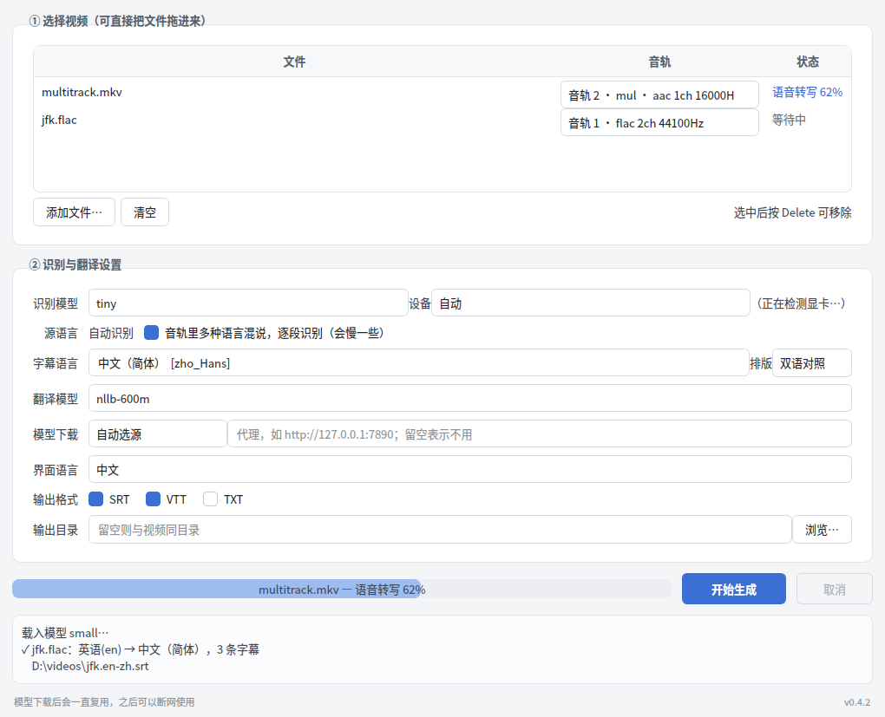

# 字幕生成工具

**中文** | [English](README.en.md)

从任意视频的音轨生成字幕：自动识别语种、支持多音轨选择，并可翻译成你要的目标语言。
全程本地运行，不上传任何内容。

- 🎬 **任意视频** — MP4 / MKV / MOV / AVI / TS / WebM…，也直接吃音频文件
- 🔊 **多音轨** — 列出片源里的每条音轨（含语言标签），按需选择
- 🌍 **多语种** — 自动识别 99 种语言；一条音轨里多语言混说也能逐段识别
- 🈯 **任选目标语言** — 99 种目标语言，可输出译文 / 原文 / 双语对照
- 📄 **SRT / VTT / TXT**，批量处理，可随时取消
- 🌐 **中英双语界面** — 默认跟随系统语言，设置里随时切换
- 🔌 **离线可用** — 首次下载模型后完全断网运行

## 快速开始

1. 到 [Releases](https://github.com/liny90626/subtitle_tool/releases) 下载
   `subtitle-tool-windows-x64.zip`
2. 解压到任意目录，双击 `SubtitleTool.exe`（免安装）
3. 把视频拖进窗口 → 选音轨和目标语言 → 点「开始生成」

首次运行会自动下载模型（识别模型按所选大小 75MB~1.6GB，翻译模型 620MB），
之后一直复用，默认存放在 `%USERPROFILE%\.cache\huggingface`。
模型托管在 huggingface.co，这个域名在国内多半连不通，程序会自动改用镜像
`hf-mirror.com`；连不上也可以在「模型下载」里手动指定下载源或填代理，
见[模型下载不动？](#模型下载不动)。

界面语言默认跟随系统，也可以在「界面语言」里手动切成中文或 English，
切换即时生效，不用重开程序。

**升级**：把新版直接解压覆盖到原目录就行。程序启动时会照发布清单清掉旧版残留的文件，
模型缓存在用户目录下、不在覆盖范围内，不用重新下载。



## 选哪个识别模型

实测数据（8 核 CPU、int8 量化、无 GPU）：

| 模型 | 下载体积 | CPU 速度 | 1 小时视频约需 | 说明 |
| --- | --- | --- | --- | --- |
| `tiny` | 78 MB | — | — | 只适合快速试跑 |
| `base` | 148 MB | 9.3× 实时 | ~6 分钟 | 图快，精度一般 |
| `small` | 486 MB | 2.7× 实时 | ~22 分钟 | **无 GPU 时的默认**，日常够用 |
| `medium` | 1.5 GB | — | — | 精度与速度折中 |
| `distil-large-v3` | 1.5 GB | — | — | 蒸馏版，比 large-v3 快不少 |
| `large-v3-turbo` | 1.6 GB | 0.72× 实时 | ~83 分钟 | **有 GPU 时的默认**，精度最好 |
| `large-v3` | 3.1 GB | — | — | 最准也最慢 |

> ⚠️ `large-v3-turbo` 在 CPU 上**比视频本身还慢**，1 小时的片子要跑 80 多分钟。
> 所以程序启动时会检测显卡：没检测到就默认用 `small`，检测到才用 `large-v3-turbo`。
> 具体耗时随 CPU 核数和音频内容浮动。

## 用 GPU 加速

免安装包只带 CPU 推理（带上 CUDA 运行库会让体积从 500MB 涨到 3GB）。
有 NVIDIA 显卡的话，装好 CUDA 12 运行库后程序会自动检测并使用：

```powershell
pip install nvidia-cublas-cu12 nvidia-cudnn-cu12
```

把这两个包安装目录里的 DLL 放到程序目录，或改用下面的源码方式运行。
设置里的「设备」保持「自动」即可，检测不到显卡会自动退回 CPU。

## 模型下载不动？

报 `ConnectTimeout: [WinError 10060]`，或者「cannot find the appropriate snapshot
folder」，都是连不上模型下载源，跟视频本身没关系。按顺序试：

1. 界面上「模型下载」保持「自动选源」——官方源连不上时会自动换成
   `hf-mirror.com` 镜像，多数情况到这一步就好了；
2. 有代理 / VPN 就把地址填进旁边的输入框，例如 `http://127.0.0.1:7890`；
3. 前两条都不行（公司内网、离线机器），在能联网的机器上把模型下好，
   再把整个 `%USERPROFILE%\.cache\huggingface` 目录复制到这台机器的同一位置。

设置存在 `%APPDATA%\subtitle-tool\settings.json`，命令行用的是同一份。
模型下过一次之后完全走本地缓存，不再联网。

程序要是异常退出，`%APPDATA%\subtitle-tool\subtitle-tool.log` 里会有堆栈，
提 issue 时带上它。

## 命令行用法

批量处理和脚本化用命令行更方便：

```bash
# 列出音轨
subtitle-tool video.mkv --list-tracks

# 用第 2 条音轨，生成中文字幕
subtitle-tool video.mkv --track 2 --target zh

# 多语言混说的音轨，输出中英双语 SRT + VTT
subtitle-tool video.mkv --multi-language --target zh --layout bilingual --format srt,vtt

# 批量处理整个目录
subtitle-tool *.mp4 --target ja --model small --output-dir ./subs

# 连不上官方源时指定镜像，或走代理
subtitle-tool video.mp4 --target zh --model-source mirror
subtitle-tool video.mp4 --target zh --proxy http://127.0.0.1:7890

# 命令行输出也分中英，--lang 跟着界面设置走，也可以临时指定
subtitle-tool video.mp4 --target zh --lang en
```

`--target` 接受 `zh` / `zho_Hans` / `中文（简体）` / `Chinese (Simplified)` 几种写法，
`--list-languages` 可以看全部可选语言。

免安装包里的 `SubtitleTool.exe` 带参数运行时就是命令行，不用另外装 Python：

```powershell
.\SubtitleTool.exe video.mkv --target zh
```

## 从源码运行

```bash
git clone https://github.com/liny90626/subtitle_tool.git
cd subtitle_tool
pip install -e ".[gui]"

subtitle-tool-gui          # 图形界面
subtitle-tool --help       # 命令行
```

需要 Python 3.9+。GPU 加速另装 `nvidia-cublas-cu12 nvidia-cudnn-cu12`。

### 开发

```bash
pip install -e ".[gui,dev]"
python scripts/make_fixture.py   # 生成多音轨测试素材
pytest -q
ruff check src tests scripts

pyinstaller subtitle_tool.spec   # 打包（在 Windows 上执行才产出 exe）
```

## 它是怎么做的

视频 → PyAV 按轨解码为 16kHz 单声道 → faster-whisper 识别语种并转写 →
按词级时间戳切成字幕大小的条目 → NLLB-200 翻译 → 写出 SRT/VTT/TXT。

技术选型对比、实测踩过的坑和已知限制都写在 [docs/design.md](docs/design.md)。

## 已知限制

- 翻译质量取决于 NLLB-600M，长句和专业术语一般般；追求质量建议导出原文字幕后
  另行翻译
- 不做说话人分离
- 整条音轨解码进内存，约每小时 230MB
- 逐段语种检测按 30 秒分组，同组内换语言会跟着组内多数走

## 许可

MIT，见 [LICENSE](LICENSE)。使用的开源项目：
[faster-whisper](https://github.com/SYSTRAN/faster-whisper)（MIT）、
[CTranslate2](https://github.com/OpenNMT/CTranslate2)（MIT）、
[PyAV](https://github.com/PyAV-Org/PyAV)（BSD）、
[NLLB-200](https://huggingface.co/facebook/nllb-200-distilled-600M)（CC-BY-NC 4.0，
**仅限非商业用途**）、[PySide6](https://doc.qt.io/qtforpython/)（LGPLv3）。
